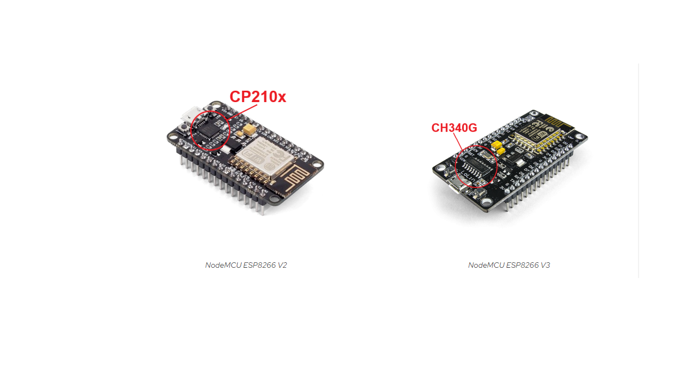
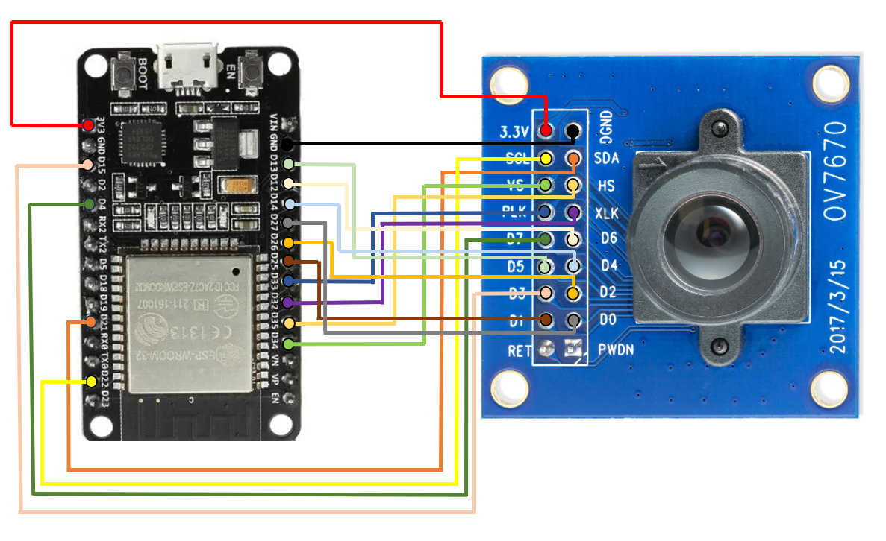
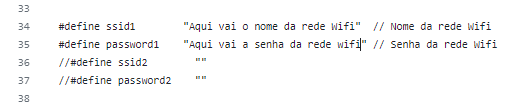
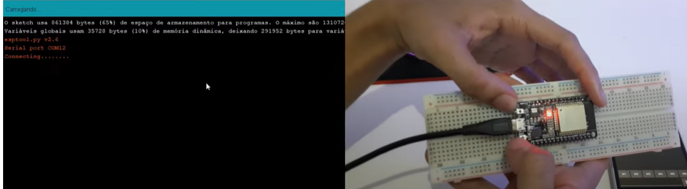
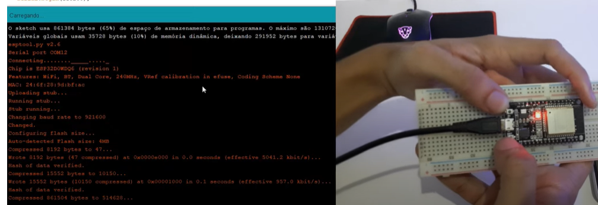
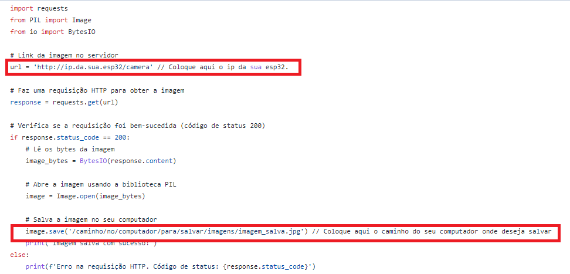

# PROJETO DE LIXEIRA INTELIGENTE COM IA

## Voce vai precisar dos seguintes componentes

- 01 - PLaca ESP32  💻
- 01 - Camera OV7670 📸
- 20 - Cabos jumpers femea x femea 🔌
- 01 - Fonte de alimentação para placa ESP32
- 01 - Cabo de transmissão de dados USB x Micro USB 🔌
- 01 - Instalar o software IDE Arduino e as bibliotecas necessarias 👨‍💻
- 01 - Instalar o python 3.09 ou superior 👨‍💻
- 01 - Instalar as bibliotecas pyhton REQUESTS, IMAGE, BytesIO 👨‍💻

## Tutorial passo a passo

**1 - PASSO INSTALAR O DRIVER DA PLACA ESP32 CONFORME O CHIP CONVERSOR USB**💻   
Os chips conversores podem ser **CP210X** ou **CH340G**   abaixo temos o link com mais detalhes para identificar 
o chip conversor da sua placa.



- [LINK ROBOCORE](https://www.robocore.net/tutoriais/instalando-driver-do-nodemcu?gad_source=1&gclid=CjwKCAiA1-6sBhAoEiwArqlGPoSBKq6nlbg5s1_0agZqCzmkurMGCsVrqhLdadiycJBM9h4euCjFcxoCx_YQAvD_BwE)

os drives podem ser baixados diretamente pelos links abaixo 

**Modelo CP210X**  
- [Windows](https://s3-sa-east-1.amazonaws.com/robocore-tutoriais/163/CP210x_Windows_Drivers.zip)  
- [Mac OSX](https://s3-sa-east-1.amazonaws.com/robocore-tutoriais/163/CP210x_Mac_OSX_VCP_Driver.zip)  
- [Linux](https://s3-sa-east-1.amazonaws.com/robocore-tutoriais/163/CP210x_Linux_2.6.x_VCP_Driver_Source.zip)

**Modelo CH340G**  
- [Windows](https://s3-sa-east-1.amazonaws.com/robocore-tutoriais/163/CH341SER_WINDOWS.zip)  
- [Mac OSX](https://s3-sa-east-1.amazonaws.com/robocore-tutoriais/163/CH341SER_MAC.ZIP)  
- [Linux](https://s3-sa-east-1.amazonaws.com/robocore-tutoriais/163/CH341SER_LINUX.ZIP)


**2 - PASSO CONECTAR A SUA PLACA ESP32 AO COMPUTADOR E EXECUTAR O PROGRAMA BLINK**( faz o LED piscar )💻👨‍💻🔌  
Este passo serve para testar se a interface de programação reconhece a placa com o driver instalado,  testar a transmissao de dados 
via cabo usb para placa, e testar a alimentação e funcionamento basico da placa a ser utilizada!

OBS: Caso tenha total certeza do funcionamento da placa e do cabo de transmissao de dados esta etapa pode ser ignorada ( não recomendavel ).


**3 - PASSO INSTALAR O PROGRAMA IDE ARDUINO**👨‍💻  
O programa pode ser baixado diretamente do site oficial clicando no link abaixo    
- [IDE_Arduino](https://www.arduino.cc/en/software)


**4 - PASSO INSTALAR AS BIBLIOTECAS NA IDE ARDUINO**👨‍💻  
siga o tutorial no site abaixo para instalar as bibliotecas necessarias para a IDE Arduino reconhecere corretamente sua placa ESP   
- [DOIT ESP32 DEVKIT v1](https://lobodarobotica.com/blog/como-instalar-esp32-ide-arduino/)
- USAR A BIBLIOTECA CONTROLADORA DE PLACA ESP32 DA EXPRESSIF NA VERSAO 2.0.17... versões superiores tiveram alterações nas modulos e quebram a aplicação atual.


**5 - PASSO INSTALAR AS BIBLIOTECAS NA IDE ARDUINO** 👨‍💻
- Adafruit GFX (Adafruit_GFX.h) 
- Adafruit ST7735 (Adafruit_ST7735.h)


 **6 - PASSO CONECTAR A PLACA ESP32 A CAMERA OV7670**💻👨‍💻🔌
 - Inserir imagem do diagrama de conexao ESP32 + OV7670



  **7 - PASSO INSERIR SSID E SENHA DA REDE WIFI PARA CONEXÃO VIA HTTP COM A CAMERA NO CODIGO**💻👨‍💻🔌  
  Modificar o arquivo ESP_L2S_Camera.ino nas linhas 34 e 35   incluindo o SSID ( nome da rede WIFI) e a senha dentro do codigo.  

  
Após realizado esse procedimento, o codigo deve ser compilado e enviado a placa esp32... na interface do IDE ARDUINO
quando aparecer a mensagem Conecting... ( enquanto estiver carregando os pontinhos, pressione o botão BOOT na placa)  
isso vai permitir que o codigo seja gravado na placa corretamente!  




imagens retiradas do canal - [Dual_Tech_talk](https://www.youtube.com/@duotechtalk)

Será necessario configurar a saida em 115200 Pounds na interface do monitor serial no Ide Arduino para conseguir visualizar o IP da placa
para realizar a conexão com a camera via http, acessando o link no seu navegador padrao http://ip.da.sua.esp32/camera  
conforme as imagens na sequencia. (isso evita que voce tenha dor de cabeça com a porta serial).  


**8 - PASSO AJUSTAR O CODIGO NO ARQUIVO CAPTURA_FRAME.PY**  
- Ajuste o ip da esp32 no codigo do arquivo captura_frame.py.
- Ajuste o caminho onde o frame capturado vai ser salvo ( ajustando conforme o caminho no seu SO).


  

**9 - PASSO BAIXAR IMAGENS PARA O DATASET - conforme o tipo de lixo seco, organico,papel,metal**@@💻👨‍💻🔌
- Baixar imagens com a biblioteca do bing usando python.
- Usar o LabelImg para realizar a classificação manual da imagem para pré-treinamento dos dados com YOLO. 

- referencias no youtube:
  
  [Como treinar uma rede yolo do zero - AiNSTEiNSbr](https://www.youtube.com/watch?v=8L3PCqADFPo&t=410s)
  
  [Detecção de Objetos - Criação de um Dataset Manual (YOLO e LabelImg)-Café e Computação](https://www.youtube.com/watch?v=lNmqxsFCUk0&t=8s)


  
**10 - PASSO TREINAR O SEU MODELO, caso nao tenha gpu dedicada o canal Café e Computação mostra um forma simples de fazer isso**
utilizando a computação em nuvem do google colab.
  [Detecção de Objetos - YOLO implementado com o Darknet no COLAB-Café e Computação](https://www.youtube.com/watch?v=4NZSbzUCa4s)

  Para usar o seu modelo YOLO, substitir os arquivos abaixo:
  
  - darknet/digo.cfg -> seu.cfg
  - darknet/digo.data -> seu.data
  - darknet/digo_8000.weigths -> seus_pesos.weigths

  Garantir que a pasta imagemsaida exista
  
  Fazendo isso e a logica, não mudando, voce pode rodar o arquivo servidor.py


  
**11 - PASSO FINAL: TESTAR A LIXEIRA INTELIGENTE**

Após configurar tudo e substituir o modelo (se necessário):

11.1- **Transferir o código para a ESP32**  
   - Compile e envie o arquivo `ESP_L2S_Camera.ino` para a placa usando a IDE Arduino.  
   - Pressione o botão `BOOT` quando solicitado para gravar o código corretamente.

11.2- **Iniciar o servidor Flask**  
   - No computador, ative o ambiente virtual (se estiver usando) e execute:
     ```bash
     python3 servidor.py
     ```
   - O servidor ficará escutando requisições na porta `5000`.

11.3- **Apertar o botão físico na lixeira**  
   - Isso enviará um POST para o servidor Flask, que irá capturar a imagem da câmera.

11.4- **Aguardar o resultado do modelo YOLO**  
   - O servidor processará a imagem e acionará o LED correspondente na ESP32 conforme a classe detectada:  
     - Papel → LED Azul  
     - Plástico → LED Vermelho  
     - Metal → LED Amarelo  
     - Orgânico → LED Verde  

11.5- **Verificar a imagem processada**  
   - Caso a classe não seja detectada, a imagem será salva em `imagemsaida/` com timestamp para análise posterior.

